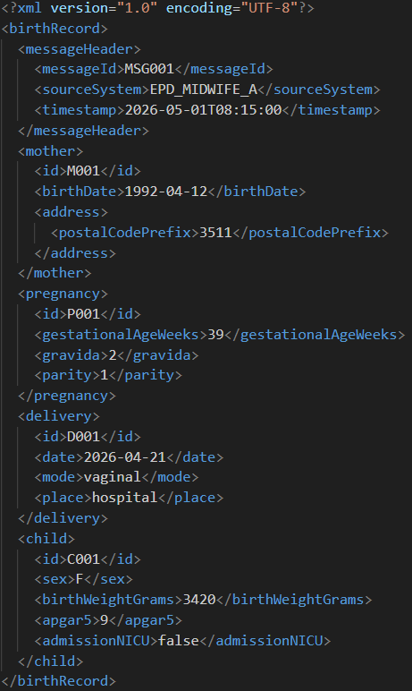
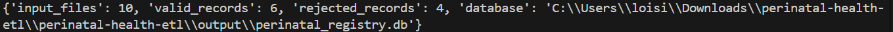
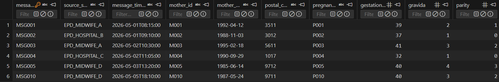
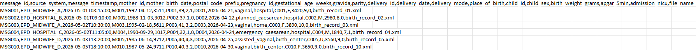
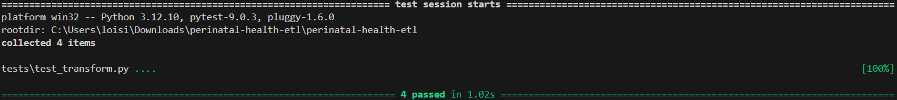
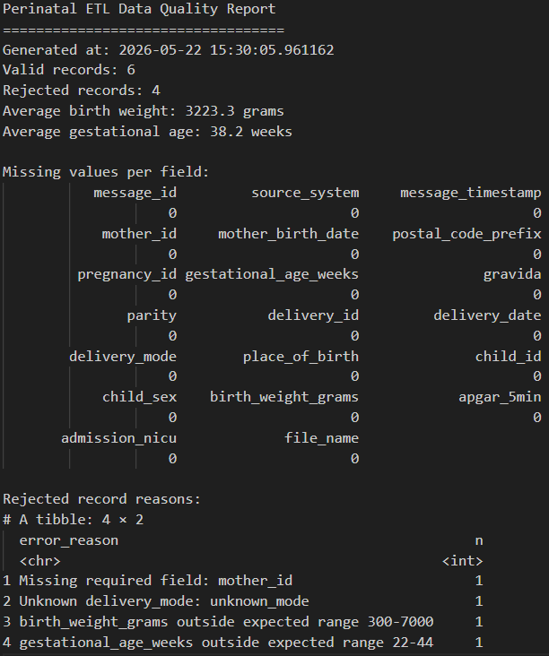

# Perinatal Health ETL Pipeline

A healthcare-oriented ETL (Extract, Transform, Load) project inspired by perinatal registry workflows and healthcare interoperability standards such as HL7/XML and FHIR.

This project simulates the ingestion and processing of perinatal healthcare messages, validates healthcare data quality rules, stores structured data in a relational database, and generates analytical outputs for downstream reporting.

The project was designed as a practical demonstration of:

- healthcare data ingestion
- XML parsing
- ETL pipeline design
- healthcare validation workflows
- relational data storage
- simplified healthcare interoperability concepts
- R-based data quality reporting

---

## Quick Start

```bash
pip install -r requirements.txt
python -m src.main
pytest
Rscript r/quality_report.R
```

## Project Context

Healthcare organizations often receive structured medical information from multiple systems. This information needs to be extracted, validated, transformed, stored, monitored, and made available for reporting.

This project simulates such a workflow using simplified perinatal healthcare XML messages. The pipeline extracts data from XML messages, applies healthcare-oriented validation rules, stores valid records in a relational database, separates rejected records, and produces outputs for reporting and analysis.

The project is inspired by perinatal registry workflows, where data quality, interoperability, traceability, and reliable processing are essential.

---

## Project Goals

The objective of this project is to simulate a simplified healthcare data pipeline similar to those used in healthcare registries and interoperability systems.

The pipeline:

- extracts healthcare data from XML messages
- transforms the messages into structured relational records
- validates healthcare-oriented business rules
- loads validated records into SQLite
- separates rejected records with error reasons
- exports analytical datasets as CSV
- generates simplified FHIR-style JSON examples
- provides an R script for downstream data quality reporting
- includes automated tests to check core ETL behavior

---

## Architecture

```text
Input XML files
    ↓
XML parsing and transformation (Python)
    ↓
Healthcare validation rules
    ↓
SQLite relational storage
    ↓
CSV exports
    ↓
Simplified FHIR-style JSON export
    ↓
R-based data quality reporting
```

---

## Technologies Used

### Python

Python is used for the core ETL pipeline:

- XML parsing
- field mapping
- data transformation
- healthcare validation
- database loading
- rejected record handling
- simplified FHIR-style export
- automated testing

Main Python libraries:

- `pandas`
- `sqlite3`
- `xml.etree.ElementTree`
- `pytest`
- `pyyaml`

### R

R is used for downstream analysis and reporting:

- data quality summaries
- statistical summaries
- healthcare-oriented reporting
- basic visualizations

Main R libraries:

- `tidyverse`
- `ggplot2`

### SQLite

SQLite is used as a lightweight relational database for storing validated healthcare records and rejected records.

---

## Features

### 1. XML Parsing

Healthcare XML messages are parsed using Python's built-in XML parser:

```python
import xml.etree.ElementTree as ET
```

The main XML parsing logic is located in:

```text
src/transform.py
```

The parser loads each XML file and extracts its root element:

```python
root = ET.parse(xml_path).getroot()
```

Then it dynamically extracts fields based on configurable mappings:

```python
record = {
    field: _text(root, xpath)
    for field, xpath in mapping.items()
}
```

This avoids hardcoding every field directly in the parser and makes the ETL logic easier to adapt if the XML structure changes.

---

### 2. Configurable Field Mapping

XML paths are defined in a YAML mapping file:

```text
config/mapping.yml
```

Example mapping:

```yaml
fields:
  message_id: messageId
  mother_id: mother/id
  child_id: child/id
  birth_weight_grams: child/birthWeightGrams
```

This means an XML element such as:

```xml
<mother>
    <id>M001</id>
</mother>
```

can be mapped to the structured field:

```text
mother_id
```

This design demonstrates how healthcare XML messages can be transformed into structured relational data using configurable extraction rules.

---

### 3. Healthcare Validation Rules

The ETL pipeline validates healthcare-oriented business rules before loading data into the database.

Validation logic is located in:

```text
src/validate.py
```

Implemented validation checks include:

- mandatory identifier validation
- missing delivery date detection
- gestational age range validation
- birth weight plausibility checks
- malformed or incomplete message rejection

Example validation rules:

- gestational age must be between 22 and 44 weeks
- birth weight must be between 300 and 7000 grams
- mother ID must be present
- child ID must be present
- delivery date must be present

Invalid records are not loaded into the main table. Instead, they are written to a rejected records table and CSV file with a clear error reason.

---

### 4. Rejected Record Handling

Rejected records are stored separately so that data quality issues can be reviewed.

Rejected outputs include:

```text
output/rejected_records.csv
```

and the SQLite table:

```text
rejected_records
```

Each rejected record contains information such as:

- file name
- message ID when available
- validation error reason

This is useful in healthcare data pipelines because incoming messages may be incomplete, malformed, or contain medically implausible values.

---

### 5. Relational Storage

Validated records are loaded into SQLite:

```text
output/perinatal_registry.db
```

The main table is:

```text
perinatal_records
```

Structured CSV outputs are also generated:

```text
output/perinatal_records.csv
output/rejected_records.csv
output/pipeline_summary.csv
```

This demonstrates the transformation from nested XML messages into structured tabular data.

---

### 6. Simplified FHIR-Style Export

The project includes a simplified FHIR-style JSON export:

```text
output/fhir_bundle_examples.json
```

This export is intended for interoperability demonstration purposes.

It is not a complete or production-grade FHIR implementation. Instead, it demonstrates an understanding of how structured healthcare data can be represented using modern healthcare interoperability concepts.

The wording "FHIR-style" is used intentionally to avoid claiming full compliance with the official FHIR standard.

---

### 7. R-Based Data Quality Reporting

The project includes an R script:

```text
r/quality_report.R
```

The R script reads generated outputs and produces healthcare-oriented data summaries such as:

- number of valid records
- number of rejected records
- average birth weight
- delivery mode distribution
- validation statistics

This separates the ETL layer from the reporting layer:

```text
Python → ingestion, validation, transformation, loading
R      → reporting, analysis, data quality summaries
```

This is a realistic architecture because data engineering pipelines often use one technology for ingestion and another for analysis or reporting.

---

### 8. Idempotent Pipeline Design

The ETL pipeline is designed to be rerunnable.

Each execution refreshes database tables and output files, avoiding duplicate record errors when the same XML files are processed multiple times.

This means the following can be safely executed repeatedly:

```bash
python -m src.main
python -m src.main
python -m src.main
```

This is important for development, testing, and production-style ETL workflows.

---

## Project Structure

```text
perinatal-health-etl/
│
├── config/
│   └── mapping.yml
│
├── data/
│   ├── input_xml/
│   ├── processed/
│   └── rejected/
│
├── output/
│   ├── perinatal_records.csv
│   ├── rejected_records.csv
│   ├── pipeline_summary.csv
│   ├── perinatal_registry.db
│   └── fhir_bundle_examples.json
│
├── r/
│   └── quality_report.R
│
├── sql/
│   └── schema.sql
│
├── src/
│   ├── __init__.py
│   ├── main.py
│   ├── transform.py
│   ├── validate.py
│   ├── load.py
│   └── fhir_export.py
│
├── tests/
│   └── test_transform.py
│
├── requirements.txt
└── README.md
```

---

## How to Run the Project

### 1. Create a virtual environment

```bash
python -m venv .venv
```

### 2. Activate the virtual environment

On Windows:

```bash
.venv\Scripts\activate
```

On Linux or macOS:

```bash
source .venv/bin/activate
```

### 3. Install dependencies

```bash
pip install -r requirements.txt
```

### 4. Run the ETL pipeline

```bash
python -m src.main
```

Expected output example:

```text
{
  'input_files': 10,
  'valid_records': 6,
  'rejected_records': 4,
  'database': 'output/perinatal_registry.db'
}
```

### 5. Run automated tests

```bash
pytest
```

### 6. Run the R report

```bash
Rscript r/quality_report.R
```

---

## Main Outputs

After running the pipeline, the following outputs are generated:

```text
output/perinatal_records.csv
output/rejected_records.csv
output/pipeline_summary.csv
output/perinatal_registry.db
output/fhir_bundle_examples.json
```

### `perinatal_records.csv`

Contains valid structured records extracted from XML messages.

### `rejected_records.csv`

Contains rejected records and validation error reasons.

### `pipeline_summary.csv`

Contains a small summary of the ETL execution.

### `perinatal_registry.db`

SQLite database containing valid and rejected records.

### `fhir_bundle_examples.json`

Simplified FHIR-style JSON examples generated from valid records.

---

## Testing

The project includes automated tests to verify core ETL behavior.

Tests cover:

- XML parsing
- configurable field mapping
- type conversion
- healthcare validation rules
- invalid healthcare values
- missing required fields
- database loading behavior
- rerunnable/idempotent loading

Example tested scenarios:

- invalid gestational age is rejected
- unrealistic birth weight is rejected
- missing identifiers are rejected
- XML fields are correctly transformed into structured fields
- database loading can be executed multiple times without duplicate key errors

Run tests with:

```bash
pytest
```

---

## Screenshots

### XML Healthcare Message



### ETL Pipeline Execution



### SQLite Database Output



### Generated CSV Output



### Tests Passing



### R Data Quality Report



---

## How This Project Relates to Healthcare Data Engineering

This project demonstrates several skills relevant to healthcare data engineering:

- processing structured healthcare messages
- transforming XML into tabular data
- validating healthcare records
- handling rejected messages
- storing data in a relational database
- generating analytical outputs
- understanding interoperability concepts
- using R for reporting and data quality analysis

The project is intentionally small, but it reflects realistic concerns in healthcare data pipelines:

- data quality
- traceability
- repeatability
- validation
- interoperability
- structured reporting

---

## Future Improvements

Potential future improvements include:

- HL7 v2 message support
- full FHIR resource modeling
- official FHIR validation
- Docker deployment
- CI/CD integration
- real-time ingestion API
- automated monitoring dashboard
- PostgreSQL support
- more advanced healthcare validation rules
- logging with structured log files
- configurable validation rules
- integration with a dashboarding tool

---

## Learning Objectives

This project was created to strengthen practical knowledge in:

- healthcare interoperability
- HL7/XML healthcare messaging
- ETL pipeline architecture
- healthcare data quality
- FHIR concepts
- healthcare-oriented data engineering workflows
- Python-based data pipelines
- R-based reporting workflows
- automated testing for data pipelines

---

## Disclaimer

This project is a technical demonstration project created for learning and portfolio purposes.

The XML messages are synthetic and do not contain real patient data.

The simplified FHIR-style export is intentionally limited and is not intended to represent a production-grade or fully compliant healthcare interoperability implementation.
